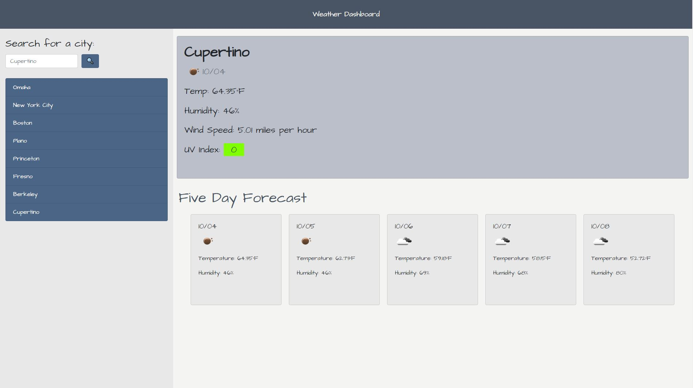

# Weather Dashboard

---

## Table of Contents

- [weather-dashboard](#weather-dashboard)
  - [Table of Contents](#table-of-contents)
  - [About the Project](#about-the-project)
  - [Prerequisites](#prerequisites)
  - [Built With](#built-with)
  - [Technologies Used](#technologies-used)
  - [Practices Used](#practices-used)
  - [Deployed Link](#deployed-link)
  - [Contributing](#contributing)
  - [License](#license)
  - [Questions](#questions)

## About the Project
 
   

## Prerequisites
Any modern internet browser will do!

## Built With
* [HTML](https://developer.mozilla.org/en-US/docs/Web/HTML)
* [CSS](https://developer.mozilla.org/en-US/docs/Web/CSS)
* [JavaScript](https://developer.mozilla.org/en-US/docs/Web/JavaScript)
* [jQuery](https://api.jquery.com/)
* [Bootstrap](https://getbootstrap.com/)
* [Moment.js](https://momentjs.com/)
* [Open Weather Map Current Weather Data API](https://openweathermap.org/current)
* [Open Weather Map One Call API](https://openweathermap.org/api/one-call-api)
* [Open Weather Map 5 Day Forecast API](https://openweathermap.org/forecast5)

## Technologies Used

* [Microsoft Visual Studio Code](https://code.visualstudio.com/)
* [Git Bash](https://git-scm.com/downloads)
* [GitHub](https://github.com/)
* [NVDA Screen Reader](https://www.nvaccess.org/)
* [WAVE Web Accessibility Evaluation Tool](https://wave.webaim.org/)
* [Lighthouse](https://developers.google.com/web/tools/lighthouse/)
* [Google Chrome Developer Tools](https://developer.chrome.com/docs/devtools/)
  

## Practices Used

* Agile style User Story and Acceptance Criteria.
* [Web Content Accessibility Guidelines](https://www.w3.org/WAI/standards-guidelines/wcag/)
  
## Deployed Link

* [See the Live Site!](https://gulpinhenry.github.io/weather-dashboard/) 

## Contributing

Contributions are welcome! Please create an issue or pull request with your input.

## License

This application is covered under the MIT license

## Questions

For any questions, please reach out by creating an issue.

Developer's Repos   
[Henry Kam](https://github.com/gulpinhenry)
